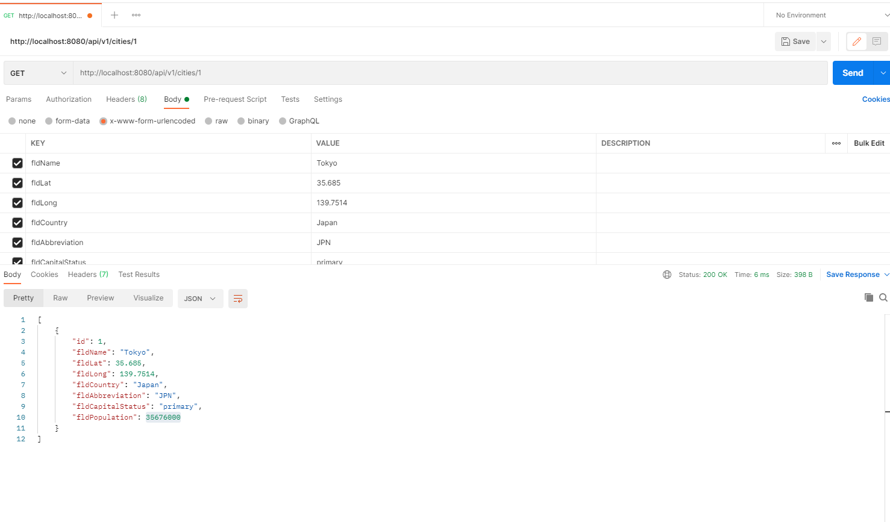

To Use:

1.  Clone the Repo
2.  Run npm install
3.  Run webpack serve to live reload your project, so you can see changes without refreshing the browser
4.  Once it's running you can go to the dev server and see your changes: http://localhost:8080/
5.  **run "webpack build" to bundle your code and put it in the docs folder so github pages can serve it**

*Get Tokyo from the database*

*Add new city called magic-city to the database*

*Delete Magic-City from the database*
